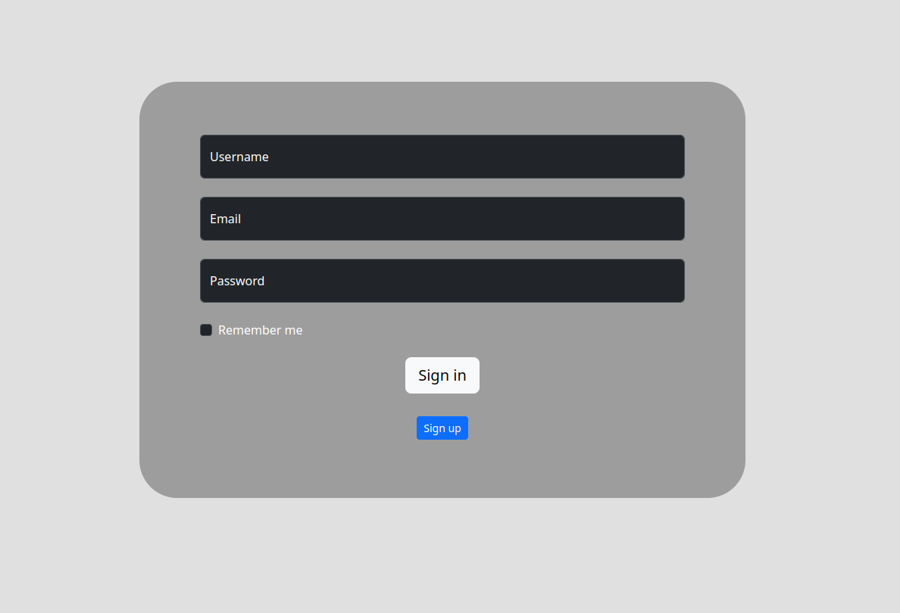
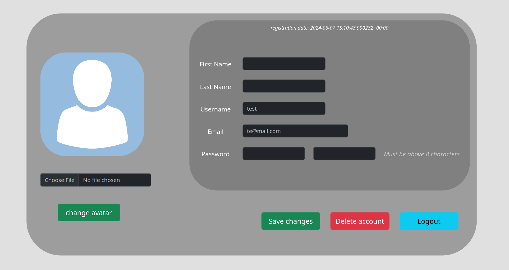

# Simple Login Register Django
Simple website for creating and managing user account written in pure Django Framework (Python). You can create a new account, login, logout, delete account, set or change avatar image and change user data (first name, username etc.). Authentication is session-based. I created this project focusing on the backend.




# How to run website
1. Go to project directory and run build script
```
chmod +x build.sh && bash build.sh
```
2. Run website with
```
chmod +x runwebsite.sh && bash runwebsite.sh
```

and in browser [open this link](http://localhost:8000/account/)

Stop website with Ctrl+C or just close terminal window.

# Configuration
You can set if you need _email_ or _username_ authentication (or both) and turn on/off _remember me_ functionality (with this you can close browser and you will not logout from website). All configuration options are in **_project-folder/source/main/settings.py_** on top file.
```
# one of this options must be 'True'.
USE_EMAIL = True
USE_USERNAME = True

# remember logged users
REMEMBER_ME = True
REMEMBER_ME_EXPIRY = int(timedelta(days=7).total_seconds())
```

You can go into admin panel on [this link](http://localhost:8000/admin/)
```
usernaname: admin
password:   admin
```

# Dependencies
* Bash for run scripts
* Python 3.11
* pip
* Django
* Pillow
